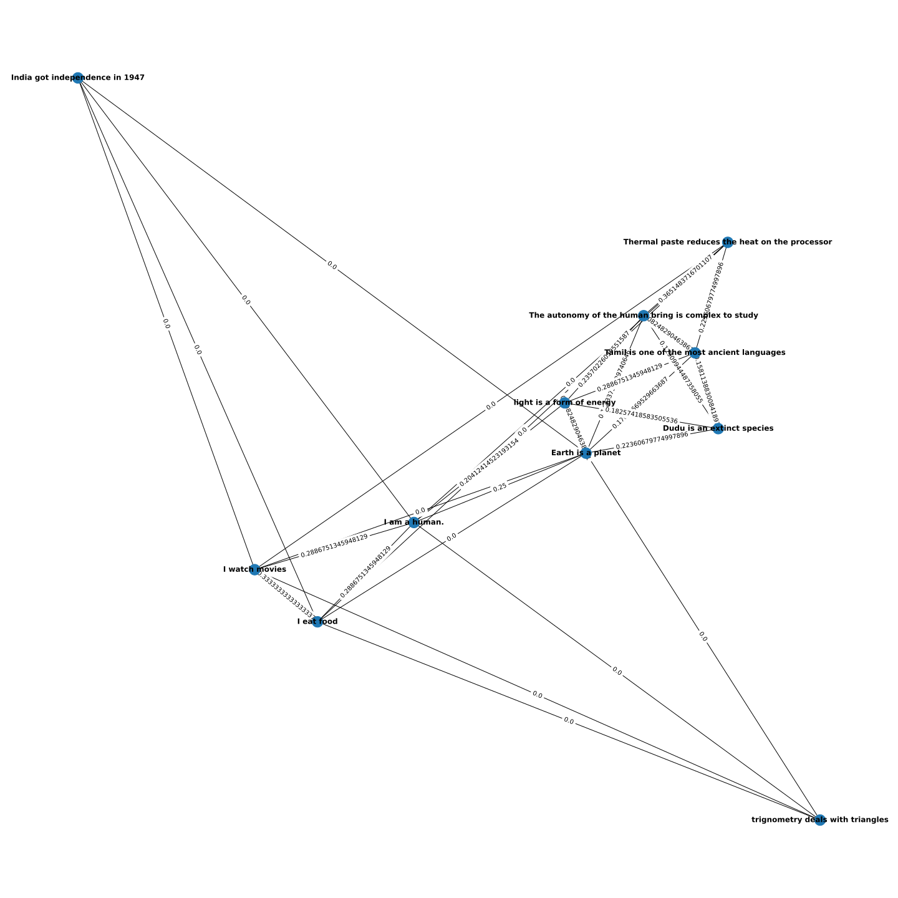

# VectorStore (W2V) Embedding
VectorStore class for managing and retrieving vectors, with a focus on similarity search using brute-force methods.
## Overview

This repository contains a simple implementation of a VectorStore for Word2Vec (W2V) embeddings built from scratch in Python using the NumPy library. The VectorStore allows for the storage and retrieval of word vectors and includes a basic method for finding similar vectors using cosine similarity.

## VectorStore Class

The `VectorStore` class is the core of the implementation, providing methods to add vectors, retrieve vectors, and find similar vectors.
- VectorStore Class: This class is designed to store and retrieve vectors. The vectors are stored in vector_data as a dictionary, and an indexing structure (vector_index) is updated to support retrieval based on similarity.

- add_vector Method: Adds a vector to the store and updates the indexing structure.

- get_vector Method: Retrieves a vector from the store based on its identifier.

- _update_index Method: Updates the indexing structure with the new vector, calculating and storing weights for edges based on the inverse of the distance.

- find_similar_vectors Method: Performs a brute-force search for similar vectors to a given query vector, returning a specified number of results sorted by similarity.

### Usage

```python
import numpy as np

# Create a VectorStore instance
vector_store = VectorStore()

# Add vectors to the store
vector_store.add_vector("word1", np.array([0.1, 0.2, 0.3]))
vector_store.add_vector("word2", np.array([0.4, 0.5, 0.6]))

# Retrieve a vector
vector = vector_store.get_vector("word1")

# Find similar vectors
similar_vectors = vector_store.find_similar_vectors(query_vector, num_results=5)
```

### Demo
```python
sentences = [
"I eat food",
              "I am a human.",
              "I watch movies",
              "Earth is a planet",
              "Thermal paste reduces the heat on the processor",
              "The autonomy of the human bring is complex to study",
              "India got independence in 1947",
              "Dudu is an extinct species",
              "light is a form of energy",
              "trignometry deals with triangles",
              "Tamil is one of the most ancient languages"
]
```

